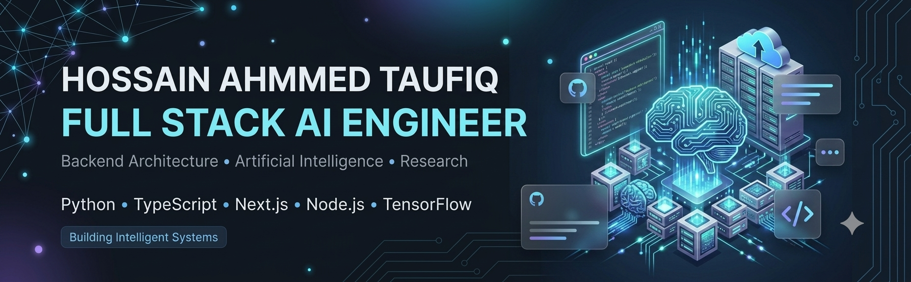

<!-- HERO BANNER -->
<div align="center">



</div>

<br/>

---

## `$ whoami`

```ts
const taufiq = {
  name        : "Hossain Ahmmed Taufiq",
  role        : "Full-Stack Engineer · Backend & AI/ML Systems",
  location    : "Dhaka, Bangladesh 🇧🇩",
  companies   : ["Justkaaj (Founder & CEO)", "Softlligence (Founder & tech Lead)"],
  education   : "B.Sc. CSE — North South University  |  CGPA 3.83 / 4.00  |  Dec 2026",
  research    : [
    "Epilepsy Detection via EEG + Deep Learning      →  journal submission",
    "Multimodal RAG with Hallucination Reduction     →  conference submission",
    "Multi-Task ML for Materials Science             →  Published ✓",
  ],
  currentFocus: "Scaling Justkaaj · Publishing research · LLM-integrated systems",
  funFact     : "Running two companies & publishing research papers simultaneously 🤯",
};
```

> 3+ years shipping production systems — from a live service marketplace (500+ users, investor-pitched) to LLM-integrated backends and peer-reviewed deep-learning research. Building at the intersection of **engineering**, **AI**, and **entrepreneurship**.

<br/>

---

## 💻 Tech Stack

<div align="center">

### Languages

<p>
  
</p>

### Frontend

<p>
  
</p>

### Backend

<p>
  
</p>

### AI & Machine Learning

<p>
  
</p>

<p>
  
  
  
</p>

### Database & DevOps

<p>
  
</p>

</div>


## 💼 Professional Experience

<br/>

### 🏗️ Founder & CEO — [Justkaaj](https://justkaaj.com) &nbsp; `Apr 2024 – Present`
> *Service Marketplace Startup · Dhaka, Bangladesh*

- 🚀 Architected and launched a full-stack service marketplace (Next.js + Node.js + PostgreSQL) with a custom ML recommendation engine — **500+ active users** · **200+ service providers** in production
- 🔐 Engineered secure REST APIs, role-based auth, real-time dashboards, and admin control panel — cutting manual overhead by **40%**
- 👥 Led a cross-functional team of **4–6 engineers & designers** through full product lifecycle: sprints, architecture, code review, roadmap
- 🏆 Secured **government funding** · Pitched to **international investors** · Validated product-market fit

<br/>

### 💻 Full-Stack Developer — Brooksource &nbsp; `Apr 2023 – Sep 2024`
> *Enterprise React Consultancy · Remote (US-based) · Fortune 500 clients*

- ⚡ Reduced front-end load time by **20%** via code splitting, lazy loading & bundle optimisation
- 🔗 Designed API integration layers that measurably reduced cross-service latency
- 📦 Shipped features **ahead of schedule** across distributed Agile teams spanning multiple time zones

<br/>

### 🌐 Web Developer — Americares &nbsp; `Nov 2022 – Jun 2023`
> *Global Non-Profit · Remote · Operating in 25+ countries*

- 📱 Built mobile-first React.js apps used by staff across global operations
- 🛡️ Reduced backend request failure rate by **25%** via retry logic, error handling & response caching
- 🔒 Hardened auth with JWT, input validation & HTTPS enforcement

<br/>

---

## 🔬 Research

<br/>

<div align="center">

| &nbsp; | Title | Status | Supervisor |
|:------:|-------|:------:|------------|
| 🧠 | **Epilepsy Detection via Deep Learning on EEG Signals** | `📝 Journal Submission` | Dr. MD. Sumon Hossain · NSU |
| 🤖 | **Multimodal RAG with Cross-Modal Hallucination Reduction** | `📢 Conference Submission` | Dr. Nabil Bin Hannan · NSU |
| ⚛️ | **Multi-Task ML for Band Gap & Formation Energy Prediction** | `✅ Published` | North South University |

</div>

<br/>

---

## 🧩 Featured Projects

<br/>

<div align="center">

| Project | Tech Stack | Highlight |
|---------|-----------|-----------|
| 🏪 [**Justkaaj**](https://justkaaj.com) — Service Marketplace | `Next.js` `Node.js` `PostgreSQL` `ML` | Live · 500+ users · Investor-pitched |
| 🤖 **AI CRM** — Web + Mobile + Telegram Bot | `Next.js` `Express` `MongoDB` `Gemini 2.5` `Kotlin` | AI task automation + Android + Telegram bot |
| 🌐 [**NSU ACM Chapter**](https://nsuacm.com) | `Next.js` `TypeScript` `CDN` | Sub-second loads · Static rendering |
| ₿ **Bitcoin Transaction Simulator** | `React` `Django` `MongoDB` | Real-trade simulation interface |
| 🎓 **University Admission Helper** | `MERN` | Dashboard-based search & filtering |

</div>

<br/>

---

## 📊 GitHub Analytics

<div align="center">


<br><br>


<br><br>


</div>
---

## 🎓 Education

<br/>

<div align="center">

| 🏛️ Institution | Degree | Score | Year |
|:---:|--------|:-----:|:----:|
| **North South University, Dhaka** | B.Sc. Computer Science & Engineering | **CGPA 3.83 / 4.00** | `Expected Dec 2025` |
| **Notre Dame College, Dhaka** | HSC — Science | **GPA 5.00 / 5.00** | `Jan 2020` |

</div>

<br/>

*Relevant coursework:* DSA · Machine Learning · AI · Software Engineering · Database Systems · Web Development

<br/>

---

## 📜 Certifications

<br/>

<div align="center">

<table>
<tr>
<td align="center"></td>
<td align="center"></td>
</tr>
<tr>
<td align="center"></td>
<td align="center"></td>
</tr>
<tr>
<td align="center" colspan="2"></td>
</tr>
</table>

</div>

<br/>

---

## 🤝 Let's Connect

<br/>

<div align="center">

*If you're building something ambitious in **backend systems**, **AI/ML infrastructure**, or **product engineering** — let's talk.*

<br/>

<table>
<tr>
<td align="center">
<a href="https://www.linkedin.com/in/hossaintaufiq/">
  
</a>
</td>
<td align="center">
<a href="mailto:hossainahmmedtaufiq22@gmail.com">
  
</a>
</td>
<td align="center">
<a href="https://github.com/hossaintaufiq">
  
</a>
</td>
</tr>
</table>

<br/>


</div>
